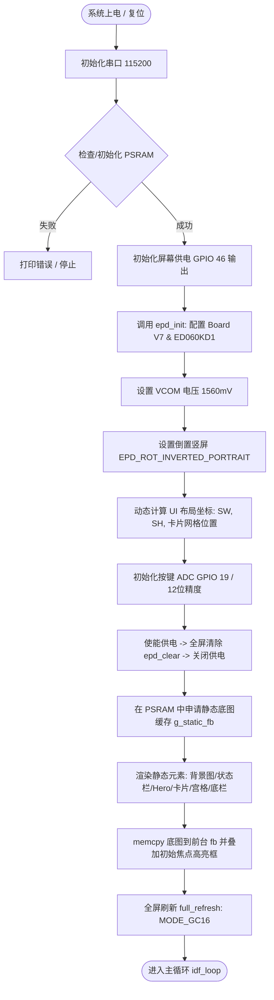
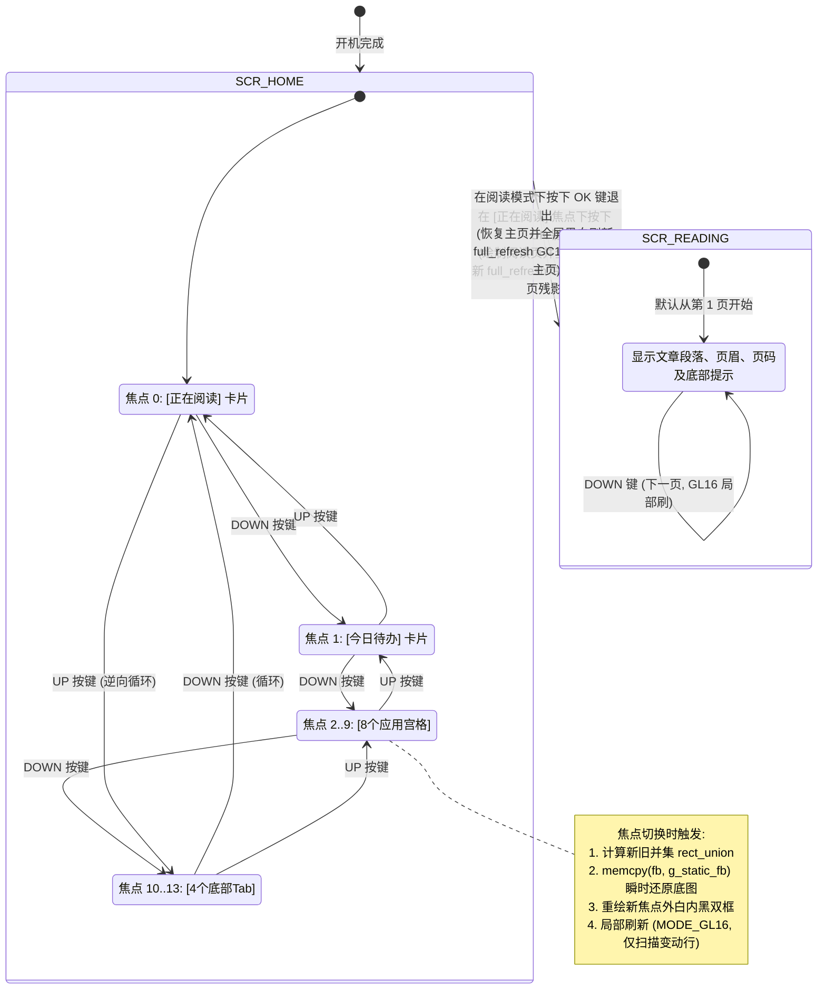

# ED060KD1-EpdiyV7 墨水屏固件流程图 (可编辑版)

本文档提供两种最通用的**可编辑**流程图格式：
1. **Draw.io 格式**：已在工程根目录下生成 `ED060KD1_Flowcharts.drawio`，包含 4 个分页，可直接在 [app.diagrams.net](https://app.diagrams.net) 或 VS Code 中可视化拖拽与编辑。
2. **Mermaid 文本格式**：如下所示的代码块，复制即可在 [Mermaid Live Editor](https://mermaid.live)、Obsidian、Typora 或 VS Code 中直接修改源码。

---

## 1. 系统上电与初始化流程 (Boot & Initialization)



---

## 2. 单引脚 ADC 电阻梯按键检测与消抖 (Button Event Detection)

```mermaid
flowchart TD
    Tick([定时器触发 / 20ms 间隔]) --> ReadADC[读取 GPIO 19 原始 12位 ADC 计数值: 0~4095]
    
    ReadADC --> InCurrentWindow{已有按键按下?<br/>且在当前键迟滞扩展区间内?}
    InCurrentWindow -- 是 --> KeyMatched[保持当前按键识别结果]
    InCurrentWindow -- 否 --> ClassifyWindows[按严格区间匹配:]
    
    ClassifyWindows --> C1{2150 <= raw <= 2950 ?}
    C1 -- 是 --> K1[判定为 KEY1 / UP]
    C1 -- 否 --> C2{1400 <= raw <= 2050 ?}
    C2 -- 是 --> K2[判定为 KEY2 / OK]
    C2 -- 否 --> C3{650 <= raw <= 1250 ?}
    C3 -- 是 --> K3[判定为 KEY3 / DOWN]
    C3 -- 否 --> KNone[判定为 BTN_NONE / 无按键]
    
    KeyMatched --> DebounceCheck
    K1 --> DebounceCheck
    K2 --> DebounceCheck
    K3 --> DebounceCheck
    KNone --> DebounceCheck
    
    DebounceCheck{采样结果 == 上次候选键?}
    DebounceCheck -- 是 --> IncCount[稳定计数器 candidate_count++]
    DebounceCheck -- 否 --> ResetCount[更新候选键，计数器重置为 1]
    
    IncCount --> StableThreshold{稳定次数 >= 3 且<br/>状态产生变化?}
    ResetCount --> RetNone([返回 BTN_NONE])
    StableThreshold -- 否 --> RetNone
    StableThreshold -- 是 --> EdgeCheck{是否为按下前沿?<br/>(prev == NONE 且 now != NONE)}
    EdgeCheck -- 是 --> EmitEvent([发出按键有效事件 BTN_UP / BTN_OK / BTN_DOWN])
    EdgeCheck -- 否 --> UpdateState[仅更新按键保持/释放状态]
    UpdateState --> RetNone
```

---

## 3. UI 状态机与页面导航 (UI State Machine & Focus Navigation)



---

## 4. 双缓冲与局部刷新时序 (Dual-Buffer & Partial Refresh)

```mermaid
sequenceDiagram
    autonumber
    actor User as 用户按键
    participant Loop as idf_loop 循环
    participant PSRAM as PSRAM 静态备份 (g_static_fb)
    participant FB as 前台显存 (fb)
    participant EPD as 电子墨水屏控制器

    Note over PSRAM: 启动时一次性渲染完所有背景和静态 UI
    User->>Loop: 按下 UP 或 DOWN
    Loop->>Loop: 计算新旧焦点脏矩形区域 rect_union(old_rect, new_rect)
    Loop->>FB: memcpy(fb, g_static_fb) 极速还原无焦点底图 (仅耗时毫秒级)
    Loop->>FB: 在新焦点区域绘制双层高亮线框 (白外框+黑内框)
    
    Note over Loop,EPD: 开始局部刷新流程
    Loop->>EPD: 使能电源 (GPIO 46 = 1)
    Loop->>EPD: epd_hl_update_area(MODE_DU, union_rect)
    Note over EPD: 驱动控制器根据 dirty_lines 只驱动变动的扫描行，<br/>无黑白闪烁平滑更新
    Loop->>EPD: 刷新完成，切断电源 (GPIO 46 = 0) 节能
```
